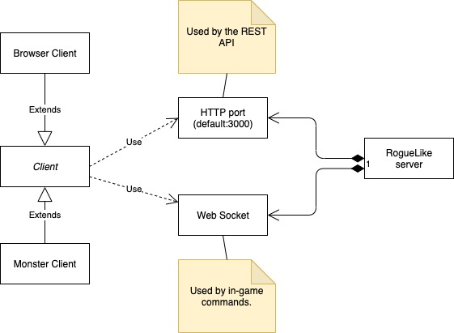
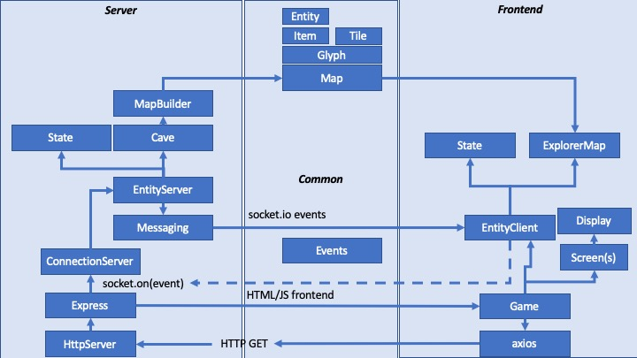

# Caverns & Kubernetes

## A Roguelike microservices ecosystem
This is the prototype for a distributed multiplayer dungeon crawl game, with a dual purpose:

- Illustrate architecture and design patterns for building microservice-based solutions hosted in kubernetes
- Be a fun and challenging game!

## To understand what RogueLike is about
- https://en.wikipedia.org/wiki/Roguelike : Wikipedia

## Setup
`npm install` to get all the code dependencies.

## Running the server
The main server is started with `npm start` and this will fire up a server that you can then point a browser to and start playing.

(You may have to let "node" accept incoming network connections)

However, all monsters in the game are run as separate microservices. You need to set the `ENV` variable `export ROLE="MONSTERS"` before running `npm start` in another shell.

## Connect to the server from a browser
If running the server locally, point your browser here: http://127.0.0.1:3000

## Keys and what they do
- Cursor left, right, up and down : obvious movement around the current map level.
- i : show Inventory
- d : drop an item
- e : eat something from your inventory
- x : examine an item from your inventory
- w : wield or wear an item from your inventory
- , : pick up an item
- \> : move down stairs
- < : move up stairs
- ? : help 
- ; : look around (using cursor keys)

## Coding
The architecture aims to enable easy extensibility of the game with new features.

```bash
src/
├── client/           # client used in web frontend and bots
├── common/           # common abstractions used in front and backend
├── frontend/         # Web frontend for players
├── monsters/         # Bot code for each type of monster
├── routes/           # REST API code
├── server/           # Code for the backend server
│   ├── config/       # home for configuration of server
│   │   └── maps/     # home for map configuration files
│   ├── entities/     # Code for each type of player or monster entity
│   ├── generators/   # Code for different types of cave generation
│   └── items/        # Code for each type of item - weapons, armour, food, etc.
└── start.sh          # Entry point for microservice
```

## Running unit tests
When coding, use these npm commands to run unit tests against the source code:
- `npm test:watch` - to continuously watch for source file changes, and re-test when they do change
- `npm test:coverage` - see what your code coverage is
- `npm test` - a one-off run through the unit tests

## Server API resources
- GET http://localhost:3000/caves - lists the caves available
- GET http://localhost:3000/health - gets the current state of the server
- GET http://localhost:3000/reset - reset the server
- GET http://localhost:3000/roles - lists the roles

## Overall Component Architecture


## Class diagrams
